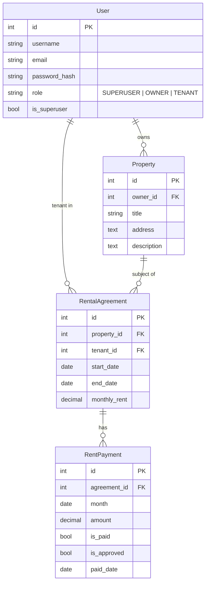

# Design Document: House Rent API

## Overview

The House Rent API is a Django REST Framework (DRF) backend for managing residential property rentals. It exposes a JSON REST API at `/api/` and enforces strict role-based access control across four resource domains: users, properties, rental agreements, and rent payments.

Three user roles drive all access decisions:

- **Superuser** — unrestricted access to all resources and administrative operations.
- **Owner** — manages their own properties and the agreements and payments associated with those properties.
- **Tenant** — read-only access to properties they rent, their own agreements, and their own payments; can submit the pay action.

The current system uses session and HTTP Basic authentication. A planned enhancement (Requirement 9) will add JWT token authentication via `djangorestframework-simplejwt`.

---

## Architecture

The application follows a standard Django layered architecture:

```
┌─────────────────────────────────────────────────────────┐
│                        HTTP Client                       │
└────────────────────────┬────────────────────────────────┘
                         │ HTTP requests to /api/
┌────────────────────────▼────────────────────────────────┐
│                   Django URL Router                      │
│          house_rent_project/urls.py → rentals/urls.py    │
│          DefaultRouter: users, properties,               │
│          agreements, payments                            │
└────────────────────────┬────────────────────────────────┘
                         │
┌────────────────────────▼────────────────────────────────┐
│                    ViewSets (views.py)                   │
│  UserViewSet │ PropertyViewSet │ RentalAgreementViewSet  │
│                  RentPaymentViewSet                      │
│  • get_permissions() — action-level permission checks    │
│  • get_queryset()    — role-scoped data visibility       │
│  • Custom actions: pay(), approve()                      │
└──────┬─────────────────┬──────────────────┬─────────────┘
       │                 │                  │
┌──────▼──────┐  ┌───────▼──────┐  ┌───────▼──────────────┐
│ Permissions │  │  Serializers │  │       Models          │
│(permissions │  │(serializers  │  │    (models.py)        │
│   .py)      │  │   .py)       │  │  User, Property,      │
│IsSuperUser  │  │UserSerializer│  │  RentalAgreement,     │
│IsOwner      │  │PropertySer.. │  │  RentPayment          │
│IsTenant     │  │AgreementSer. │  └───────────┬───────────┘
│IsOwnerOrAdm │  │PaymentSer..  │              │
│IsTenantOr.. │  └──────────────┘              │
└─────────────┘                       ┌────────▼────────┐
                                      │  SQLite Database │
                                      │  (db.sqlite3)    │
                                      └─────────────────┘
```

### Future: JWT Authentication Layer

When Requirement 9 is implemented, `djangorestframework-simplejwt` will be added. The auth flow will be:

```
Client → POST /api/auth/token/         → obtain access + refresh tokens
Client → POST /api/auth/token/refresh/ → exchange refresh for new access token
Client → Any /api/ endpoint with Authorization: Bearer <token>
```

`DEFAULT_AUTHENTICATION_CLASSES` in `settings.py` will be extended to include `JWTAuthentication` alongside the existing session and basic auth backends.

---

## Components and Interfaces

### Auth Service

Handles request authentication. Currently: `SessionAuthentication` + `BasicAuthentication` from DRF. Future: `JWTAuthentication` from `djangorestframework-simplejwt`.

Unauthenticated requests to any `/api/` endpoint return HTTP 403 (DRF default with `IsAuthenticated` as the global permission class).

### User Manager (`UserViewSet`)

| Action | Method | URL | Permission |
|--------|--------|-----|------------|
| List users | GET | `/api/users/` | IsAuthenticated (scoped) |
| Create user | POST | `/api/users/` | IsSuperUser |
| Retrieve user | GET | `/api/users/{id}/` | IsAuthenticated (scoped) |
| Update user | PUT/PATCH | `/api/users/{id}/` | IsAuthenticated (scoped) |
| Delete user | DELETE | `/api/users/{id}/` | IsAuthenticated (scoped) |

Visibility: Superuser sees all users; non-superusers see only their own record.

### Property Manager (`PropertyViewSet`)

| Action | Method | URL | Permission |
|--------|--------|-----|------------|
| List properties | GET | `/api/properties/` | IsAuthenticated (scoped) |
| Create property | POST | `/api/properties/` | IsOwnerOrAdmin |
| Retrieve property | GET | `/api/properties/{id}/` | IsAuthenticated (scoped) |
| Update property | PUT/PATCH | `/api/properties/{id}/` | IsOwnerOrAdmin |
| Delete property | DELETE | `/api/properties/{id}/` | IsOwnerOrAdmin |

Visibility: Superuser → all; Owner → own properties; Tenant → properties with an active agreement.

Future (Req 11): `?search=`, `?address=` query parameters via `django-filter` or DRF `SearchFilter`.

### Agreement Manager (`RentalAgreementViewSet`)

| Action | Method | URL | Permission |
|--------|--------|-----|------------|
| List agreements | GET | `/api/agreements/` | IsAuthenticated (scoped) |
| Create agreement | POST | `/api/agreements/` | IsOwnerOrAdmin |
| Retrieve agreement | GET | `/api/agreements/{id}/` | IsAuthenticated (scoped) |
| Update agreement | PUT/PATCH | `/api/agreements/{id}/` | IsOwnerOrAdmin |
| Delete agreement | DELETE | `/api/agreements/{id}/` | IsOwnerOrAdmin |

Visibility: Superuser → all; Owner → agreements for their properties; Tenant → own agreements.

### Payment Manager (`RentPaymentViewSet`)

| Action | Method | URL | Permission |
|--------|--------|-----|------------|
| List payments | GET | `/api/payments/` | IsAuthenticated (scoped) |
| Create payment | POST | `/api/payments/` | IsAuthenticated |
| Retrieve payment | GET | `/api/payments/{id}/` | IsAuthenticated (scoped) |
| Update payment | PUT/PATCH | `/api/payments/{id}/` | IsAuthenticated |
| Delete payment | DELETE | `/api/payments/{id}/` | IsAuthenticated |
| Pay action | POST | `/api/payments/{id}/pay/` | IsAuthenticated (tenant check in view) |
| Approve action | POST | `/api/payments/{id}/approve/` | IsOwnerOrAdmin |

Visibility: Superuser → all; Owner → payments for their properties' agreements; Tenant → own payments.

Future (Req 10): `?agreement=`, `?month=`, `?is_paid=`, `?is_approved=` filter parameters.
Future (Req 12): `?overdue=true` filter; `is_overdue` computed field in serializer.

### Permission Classes

| Class | Grants access to |
|-------|-----------------|
| `IsSuperUser` | `is_superuser=True` users only |
| `IsOwner` | `role=OWNER` users |
| `IsTenant` | `role=TENANT` users |
| `IsOwnerOrAdmin` | `role=OWNER` or `is_superuser=True` |
| `IsTenantOrOwnerOrAdmin` | Any authenticated user with a valid role |

---

## Data Models



### Serializer Field Exposure

| Model | Exposed fields | Write-only | Read-only |
|-------|---------------|------------|-----------|
| User | id, username, email, role, password | password | — |
| Property | id, owner, owner_username, title, address, description | — | owner, owner_username |
| RentalAgreement | id, property, property_title, tenant, tenant_username, start_date, end_date, monthly_rent | — | property_title, tenant_username |
| RentPayment | id, agreement, agreement_details, month, amount, is_paid, is_approved, paid_date | — | is_approved, agreement_details |

### Future: is_overdue Computed Field (Req 12)

`RentPaymentSerializer` will add a `SerializerMethodField`:

```python
is_overdue = serializers.SerializerMethodField()

def get_is_overdue(self, obj):
    if obj.is_paid:
        return False
    return date.today() > obj.month
```

---

## Design Notes for Future Enhancements

### Requirement 9: JWT Authentication

- Add `djangorestframework-simplejwt` to `INSTALLED_APPS` and `requirements.txt`.
- Extend `DEFAULT_AUTHENTICATION_CLASSES` with `JWTAuthentication`.
- Add `path('api/auth/', include('rest_framework_simplejwt.urls'))` to `house_rent_project/urls.py`.
- Configure `SIMPLE_JWT` in `settings.py`: `ACCESS_TOKEN_LIFETIME = timedelta(minutes=60)`, `REFRESH_TOKEN_LIFETIME = timedelta(days=7)`.
- Existing session and basic auth backends remain active for backward compatibility during transition.

### Requirement 10: Payment Filtering

- Add `django-filter` to dependencies.
- Add `DEFAULT_FILTER_BACKENDS` to `REST_FRAMEWORK` settings.
- Create a `RentPaymentFilter` using `django_filters.FilterSet` with fields: `agreement`, `month`, `is_paid`, `is_approved`.
- Set `filterset_class = RentPaymentFilter` on `RentPaymentViewSet`.
- Visibility scoping in `get_queryset` is applied first; filters are applied on top of the scoped queryset.

### Requirement 11: Property Search and Filtering

- Add `SearchFilter` and `OrderingFilter` to `PropertyViewSet.filter_backends`.
- Set `search_fields = ['title', 'address']` for `?search=` support.
- Add `filterset_fields = ['address']` for exact address filtering.
- Visibility scoping in `get_queryset` runs before filter backends, ensuring isolation is never bypassed.

### Requirement 12: Late Payment Tracking

- Add `is_overdue` as a `SerializerMethodField` on `RentPaymentSerializer` (computed, not stored).
- Add `?overdue=true` support in `RentPaymentViewSet.get_queryset` using a date comparison: `month__lt=today, is_paid=False`.
- No schema migration required since `is_overdue` is computed at serialization time.

---

## Correctness Properties

*A property is a characteristic or behavior that should hold true across all valid executions of a system — essentially, a formal statement about what the system should do. Properties serve as the bridge between human-readable specifications and machine-verifiable correctness guarantees.*

### Property 1: Unauthenticated requests are always rejected

*For any* `/api/` endpoint, a request made without credentials should receive HTTP 403.

**Validates: Requirements 1.1**

### Property 2: Invalid credentials are rejected without leaking internals

*For any* request carrying invalid credentials (wrong password, malformed token), the response should be HTTP 403 and the response body should contain no stack trace or internal system details.

**Validates: Requirements 1.4**

### Property 3: Only superusers can create users

*For any* user with role OWNER or TENANT, a POST to `/api/users/` should return HTTP 403.

**Validates: Requirements 2.1, 2.5**

### Property 4: Passwords are stored as hashes

*For any* user created via the API, the value stored in the database for the password field should not equal the plaintext password submitted in the request.

**Validates: Requirements 2.2**

### Property 5: Non-superusers see only their own user record

*For any* authenticated non-superuser, a GET to `/api/users/` should return exactly one record whose `id` matches the requesting user's id.

**Validates: Requirements 2.3**

### Property 6: Response fields never include password

*For any* user read response (list or detail), the JSON object should not contain a `password` key.

**Validates: Requirements 2.6**

### Property 7: Owner auto-assignment on property creation

*For any* owner user who creates a property, the returned `owner` field should equal that user's id.

**Validates: Requirements 3.1**

### Property 8: Role-scoped visibility for properties

*For any* owner, all properties returned by GET `/api/properties/` should have `owner == that owner's id`. *For any* tenant, all returned properties should have at least one agreement where `tenant == that tenant's id`.

**Validates: Requirements 3.2, 3.3**

### Property 9: Tenants cannot write properties

*For any* tenant user, POST, PUT, PATCH, or DELETE to `/api/properties/` or `/api/properties/{id}/` should return HTTP 403.

**Validates: Requirements 3.5**

### Property 10: Role-scoped visibility for agreements

*For any* owner, all agreements returned by GET `/api/agreements/` should have `property__owner == that owner's id`. *For any* tenant, all returned agreements should have `tenant == that tenant's id`.

**Validates: Requirements 4.2, 4.3**

### Property 11: Tenants cannot write agreements

*For any* tenant user, POST, PUT, PATCH, or DELETE to `/api/agreements/` or `/api/agreements/{id}/` should return HTTP 403.

**Validates: Requirements 4.5**

### Property 12: Role-scoped visibility for payments

*For any* owner, all payments returned by GET `/api/payments/` should trace back to an agreement whose `property__owner == that owner's id`. *For any* tenant, all returned payments should have `agreement__tenant == that tenant's id`.

**Validates: Requirements 5.2, 5.3**

### Property 13: Tenants cannot set is_approved via PUT/PATCH

*For any* tenant user and any payment, submitting a PUT or PATCH with `is_approved=true` should not change the `is_approved` value of the payment.

**Validates: Requirements 5.6**

### Property 14: Pay action sets is_paid and paid_date

*For any* payment and its associated tenant, calling POST `/api/payments/{id}/pay/` should result in `is_paid=True` and `paid_date` equal to the current date.

**Validates: Requirements 6.1**

### Property 15: Pay action is restricted to the agreement's tenant

*For any* payment, calling the pay action as a user who is neither the agreement's tenant nor a superuser should return HTTP 403.

**Validates: Requirements 6.3**

### Property 16: paid_date is immutable after payment

*For any* payment with `is_paid=True`, reading the payment multiple times should always return the same `paid_date` value.

**Validates: Requirements 6.4**

### Property 17: Approve action sets is_approved

*For any* payment and any owner or superuser, calling POST `/api/payments/{id}/approve/` should result in `is_approved=True`.

**Validates: Requirements 7.1**

### Property 18: Approve action is restricted to owners and superusers

*For any* tenant user and any payment, calling the approve action should return HTTP 403.

**Validates: Requirements 7.3**

### Property 19: Cross-owner isolation

*For any* two distinct owners A and B, owner A should receive HTTP 404 when requesting any property, agreement, or payment that belongs to owner B.

**Validates: Requirements 8.1, 8.4**

### Property 20: Cross-tenant isolation

*For any* two distinct tenants A and B, tenant A should receive HTTP 404 when requesting any agreement or payment that belongs to tenant B.

**Validates: Requirements 8.2, 8.4**

### Property 21: JWT authentication accepts valid tokens

*For any* valid JWT access token obtained from `/api/auth/token/`, a request to any protected endpoint with `Authorization: Bearer <token>` should be authenticated successfully.

**Validates: Requirements 9.2**

### Property 22: Invalid or expired JWT tokens are rejected

*For any* expired, malformed, or tampered JWT string, the API should return HTTP 401.

**Validates: Requirements 9.4**

### Property 23: Payment filter by agreement respects visibility

*For any* owner and any agreement id, GET `/api/payments/?agreement={id}` should return only payments for that agreement, and only if that agreement belongs to the owner's properties.

**Validates: Requirements 10.1**

### Property 24: Payment filter by is_paid returns correct subset

*For any* user and any value of `is_paid`, GET `/api/payments/?is_paid={value}` should return only payments matching that value, scoped to the user's visibility.

**Validates: Requirements 10.2**

### Property 25: Payment filter by month returns correct subset

*For any* user and any month value, GET `/api/payments/?month={YYYY-MM}` should return only payments whose `month` field matches, scoped to the user's visibility.

**Validates: Requirements 10.3**

### Property 26: Property search is case-insensitive and visibility-scoped

*For any* user and any search term, GET `/api/properties/?search={term}` should return only properties where `title` or `address` contains the term (case-insensitive), and only within the user's visibility scope.

**Validates: Requirements 11.1, 11.3**

### Property 27: is_overdue is correctly computed

*For any* payment where `month < today` and `is_paid=False`, the `is_overdue` field in the response should be `True`. *For any* payment where `is_paid=True` or `month >= today`, `is_overdue` should be `False`.

**Validates: Requirements 12.1, 12.3**

### Property 28: Overdue filter returns only overdue payments

*For any* owner, GET `/api/payments/?overdue=true` should return only payments where `is_overdue` is `True`, scoped to the owner's properties.

**Validates: Requirements 12.2**

---

## Error Handling

| Scenario | HTTP Status | Notes |
|----------|-------------|-------|
| Unauthenticated request | 403 | DRF default with `IsAuthenticated` global permission |
| Invalid credentials | 403 | No internal details exposed |
| Expired/invalid JWT (future) | 401 | `simplejwt` default |
| Permission denied (wrong role) | 403 | Returned by permission classes |
| Resource outside visibility scope | 404 | `get_queryset` scoping causes object not found |
| Validation error (bad payload) | 400 | DRF serializer validation |
| Resource not found | 404 | Standard DRF 404 |

Key design decision: out-of-scope resources return **404, not 403**. This prevents information leakage — a user cannot distinguish between "this resource doesn't exist" and "this resource exists but you can't see it."

---

## Testing Strategy

### Dual Testing Approach

Both unit tests and property-based tests are required. They are complementary:

- **Unit tests** verify specific examples, integration points, and error conditions.
- **Property-based tests** verify universal invariants across many generated inputs.

### Unit Tests

Focus areas:
- Authentication: valid session login, valid basic auth, invalid credentials.
- User creation: superuser creates user successfully; non-superuser gets 403.
- Pay action: correct tenant pays → 200 + correct response body; wrong user → 403.
- Approve action: owner approves → 200 + correct response body; tenant → 403.
- JWT token endpoint (Req 9): obtain tokens, refresh token, decode and check expiry claims.
- Overdue filter (Req 12): specific date scenarios (past month unpaid, current month unpaid, paid past month).

### Property-Based Tests

Use `hypothesis` with `hypothesis-django` for property-based testing. Each test should run a minimum of **100 iterations**.

Tag format for each test:
```
# Feature: house-rent-api, Property {N}: {property_text}
```

Key property tests to implement:

| Property | Test approach |
|----------|--------------|
| P1: Unauthenticated rejection | Generate random endpoint paths; assert 403 |
| P3: Only superusers create users | Generate OWNER/TENANT users; assert POST /api/users/ → 403 |
| P5: Non-superuser sees only self | Generate N users; for each non-superuser, assert list length == 1 and id matches |
| P8: Role-scoped property visibility | Generate owners with multiple properties; assert each owner only sees their own |
| P10: Role-scoped agreement visibility | Generate owners/tenants with agreements; assert scoping holds |
| P12: Role-scoped payment visibility | Generate payments across multiple owners/tenants; assert scoping holds |
| P13: is_approved immutable via PUT/PATCH | Generate payments; tenant PATCH with is_approved=true; assert unchanged |
| P14: Pay sets is_paid and paid_date | Generate payments; call pay(); assert is_paid=True and paid_date=today |
| P19: Cross-owner isolation | Generate two owners with separate resources; assert 404 on cross-access |
| P20: Cross-tenant isolation | Generate two tenants; assert 404 on cross-access |
| P26: Search is case-insensitive | Generate properties with known titles; search with varied casing; assert results |
| P27: is_overdue correctness | Generate payments with varied month/is_paid combos; assert is_overdue matches definition |

Each correctness property must be implemented by a **single** property-based test referencing its property number.
